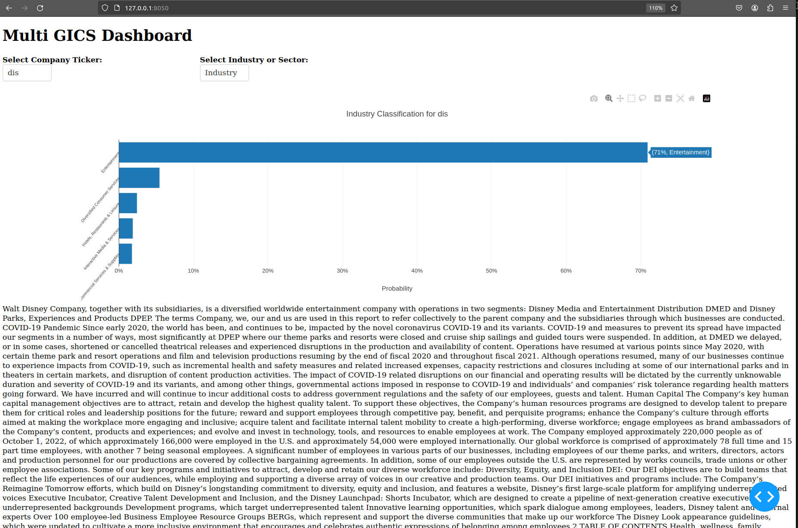

# Introduction
This project is based on paper Company Similarity using Large Language Models by D Vamvourellis et al.(2023) from BlackRock.

The original paper tested both open-source and proprietary LLMs. I only tested the open-source part of the paper due to cost. This project generates embeddings for stocks in the Russell 3000 universe using LLM fine tuned by SEC 10-K data.

**If you find this repo useful, please star it to help others find it! It is also the only way I can tell how useful it is to the open source community.**

# Embeddings
For each company in the universe, is is assigned to a industry by [GICS](https://www.msci.com/our-solutions/indexes/gics).The idea is to use these industry classifications as label and company description in 10-K Section 1 to fine tune a LLM like Bert or sentence Bert based on. The final embedding is generated by averaging over multiple embeddings of a company description due to input length limitation.

# Infer GICS
By design, each company is assigned to only 1 sector and industry by its primary business. However, a company can potentially involve in other business other than the one specified in GICS. The goal is to infer other industries by assigning probabilities. To achieve the goal, we use the embeddings as feature and GICS industry / sector as label to train a multinomial logistic regression, the predicted probabilities are used as GICS percentage.

# Application
A simple Dash dashboard is made to demonstrate multiple GICS industries or sectors inferred from the classifier tuned in embedding step. You can select a company by its ticker and view its description and inferred GICS industries / sectors. For example, Disney (DIS) is classified into _Entertainment_ (71%), _Diversified Consumer Services_(5%), and _Hotel, Restraurants & Leisure_ (2%) etc.

 
I created a SQLite database, which stores company descriptions and embeddings.
To run the app locally, follow these steps:

* Clone the repo. It contains a large SQLite db file, so it can take some time.
* Install packages in a virtual environment based on `requirements.txt`.
* Activate venv.
* cd to `src/viz` and run `python app.py`.
* Open a browser and use `http://127.0.0.1:8050/` to access the dashboard.

# How to Reproduce the Results
* add following environment variables
    * `SEC_DIR`: directory for storing company descriptions as text file.
    * `BERT_MODEL_DIR`: direcotry for storing fine-tuned Bert model.
    * `BERT_MODEL_DIR`: direcotry for storing fine-tuned Sentence Bert model.
* Activate venv.
* SEC data scraping: `python src/data/sec_data/fetch_submission.py`. If you encounter errro due to unstable network, simply rerun the script until all the companies are fetched.
* Fine tune bert model `python src/model/fine_tune/bert_fine_tune.py`.
* Creat local sqlite database `python src/data/db/local_db.py.`

